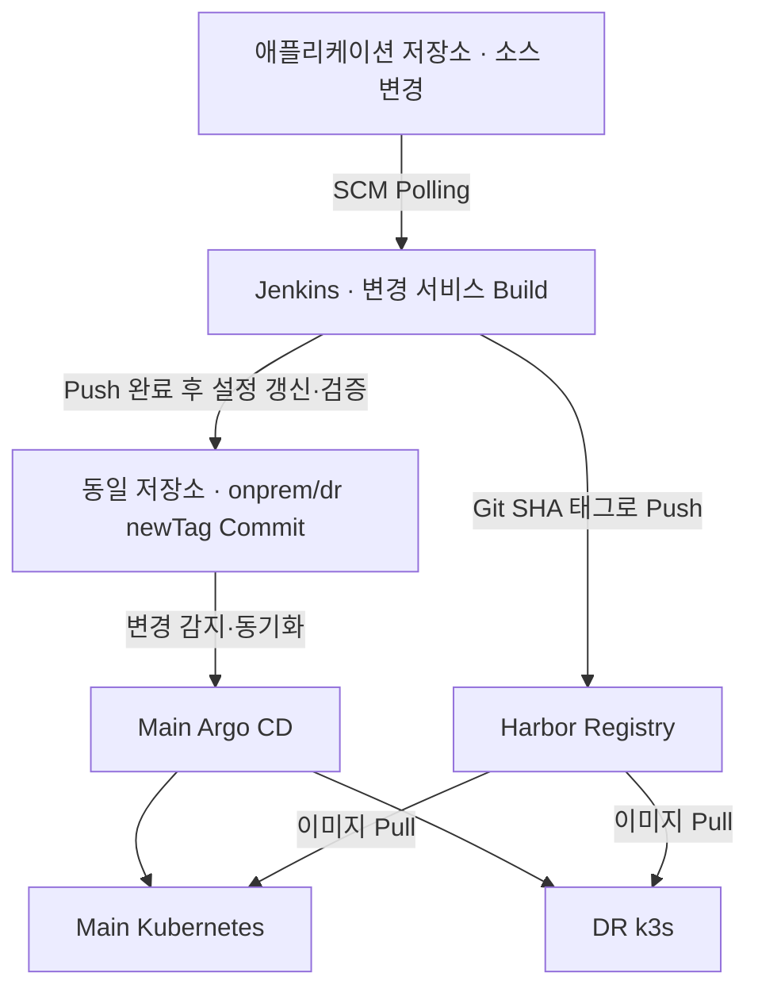

# NeuroPlan Infrastructure & CI/CD Automation

**Ansible 기반 온프레미스 인프라 설정, CI/CD 구성 및 DR 배포 연계 자동화**

InfraReady 1차 프로젝트에서 반복되는 서버 설정과 운영 점검을 표준화하고, NeuroPlan 애플리케이션의 빌드·배포 흐름을 Main Kubernetes와 DR k3s 환경까지 연결한 저장소입니다.

공통 서버 설정, Harbor 이미지 저장소, Jenkins·Argo CD, DR k3s, 메트릭 수집 구성 및 서비스 상태 점검을 기능별 Playbook과 Role로 관리합니다.

## 1. 주요 구현 범위

| 영역 | 구현 내용 | 관련 코드 |
|---|---|---|
| 공통 서버 설정 | Hostname, Timezone, 기본 패키지, SSH 서비스, hosts, DNS·NTP Client 설정 | [common](roles/common/), [hosts_config](roles/hosts_config/), [dns_client](roles/dns_client/), [ntp](roles/ntp/) |
| Kubernetes 사전 설정 | SELinux permissive 및 firewalld 비활성화 | [k8s_common](roles/k8s_common/) |
| 컨테이너 이미지 저장소 | Harbor 설치, 프로젝트·Robot Account 구성, 런타임 Registry 설정 및 Image Pull Secret 배포 | [Harbor 설치](roles/harbor/), [초기 구성](roles/harbor_bootstrap/), [런타임 설정](roles/harbor_registry/), [Pull Secret](roles/harbor_pull_secret/) |
| CI 환경 | Java·Maven·Node.js·Docker·kubectl 설치, Jenkins 및 Job·Credential 구성 | [DevOps Playbook](playbooks/devops.yml), [jenkins](roles/jenkins/) |
| CD 환경 | Helm을 통한 Argo CD 설치 및 Main Application 구성 | [helm](roles/helm/), [argocd](roles/argocd/) |
| DR 환경 | k3s 구축, Argo CD 접근 권한 및 클러스터 등록, DR Application·Secret 구성 | [k3s](roles/k3s/), [접근 권한](roles/k3s_argocd_access/), [클러스터 등록](roles/argocd_dr_cluster/), [DR Application](roles/argocd_dr_application/), [DR Secret](roles/dr_application_secrets/) |
| 메트릭 수집 | 일반 VM·Main Kubernetes의 Node Exporter 및 DR 모니터링 리소스 구성 | [VM Exporter](roles/node_exporter_vm/), [Kubernetes Exporter](roles/node_exporter_k8s/), [DR 모니터링](roles/k3s_monitoring/) |
| Object Storage | MinIO 서비스 및 데이터 경로 구성 | [minio](roles/minio/) |
| 운영 점검 | LB·DB·NFS·DNS·NTP 서비스와 연결 상태 확인 | [Playbooks](playbooks/), [infra_check](roles/infra_check/) |

이 저장소의 LB·DB·NFS 점검 Playbook은 기존 구성의 상태를 확인합니다. HAProxy·Keepalived 구성과 DR 트래픽 연결은 네트워크 담당자의 작업 범위이며, 장애 주입 및 복구 시간 측정은 팀의 별도 검증 결과로 관리합니다.

## 2. 저장소 구성

| 경로 | 용도 |
|---|---|
| [ansible.cfg](ansible.cfg) | 기본 Inventory, Role 경로, 원격 계정 및 SSH Key 경로 |
| [inventory/hosts.ini](inventory/hosts.ini) | Management 네트워크 기준 대상 호스트와 그룹 |
| [inventory/group_vars/](inventory/group_vars/) | 공통·그룹별 환경 변수 |
| [playbooks/](playbooks/) | 기능별 실행 진입점 및 운영 점검 |
| [roles/](roles/) | 설치·설정·검증 작업을 분리한 재사용 단위 |
| [collections/requirements.yml](collections/requirements.yml) | Ansible Collection 의존성 |
| [scripts/inventory-summary.sh](scripts/inventory-summary.sh) | Inventory 요약 스크립트 |
| [site.yml](site.yml) | 공통 설정·모니터링·MinIO·DevOps 구성을 묶은 Playbook |

Role별 상세 구성은 [Roles 안내](roles/README.md)를 참고합니다.

## 3. CI/CD 구성

### 저장소 간 역할

| 저장소 | 관리 대상 |
|---|---|
| **현재 저장소** | 인프라·CI/CD 도구 설치 및 설정, DR 연계, 운영 점검 |
| **[애플리케이션 저장소](https://github.com/Infrastructure-hybrid09/onprem-k8s-application-devopsVM)** | 애플리케이션 소스, 루트의 Jenkinsfile, 환경별 Kustomize 배포 설정 |

애플리케이션 소스와 Kubernetes 배포 설정은 **동일한 애플리케이션 저장소**에서 관리합니다. Jenkins가 해당 저장소의 배포 설정을 갱신하고, Argo CD가 환경별 경로를 참조합니다.

### 빌드 및 배포 흐름



1. Jenkins가 SCM Polling으로 애플리케이션 저장소의 변경을 감지합니다.
2. Frontend·Backend 경로의 변경 여부를 각각 판별합니다.
3. 변경된 서비스만 이미지를 빌드하고 Git Commit SHA 기반 태그로 Harbor에 Push합니다.
4. 동일 저장소의 On-prem·DR Kustomize 설정에서 해당 이미지의 `newTag`를 갱신합니다.
5. `kubectl kustomize`로 두 환경의 설정을 렌더링하고 예상 이미지 태그가 포함되어 있는지 확인합니다.
6. 변경된 배포 설정을 `main` 브랜치에 Commit·Push합니다.
7. Argo CD가 각 환경의 배포 경로를 참조해 Kubernetes에 반영합니다.

구현: [Jenkinsfile](https://github.com/Infrastructure-hybrid09/onprem-k8s-application-devopsVM/blob/main/Jenkinsfile)

### 변경 대상별 실행 정책

| 변경 대상 | 이미지 Build·Push | 배포 설정 갱신 |
|---|---|---|
| Frontend 소스 | Frontend만 실행 | On-prem·DR의 Frontend 태그 |
| Backend 소스 | Backend만 실행 | On-prem·DR의 Backend 태그 |
| Frontend·Backend 소스 | 두 서비스 실행 | On-prem·DR의 두 이미지 태그 |
| Kustomize 설정만 변경 | Skip | 소스 변경에 따른 태그 갱신 Stage도 Skip |

Jenkins가 생성한 배포 설정 커밋이 다시 감지되어도 소스 변경이 없으면 Build·Push를 생략합니다. 파이프라인 재실행 자체를 차단하는 방식은 아닙니다.

이미지 태그는 `git rev-parse --short=7 HEAD`로 생성합니다. 서비스별로 선택 빌드하므로 Frontend와 Backend 태그는 서로 다를 수 있습니다. 또한 이미지의 소스 커밋 SHA와 이후 생성되는 배포 설정 커밋 SHA는 구분해서 확인해야 합니다.

### 배포 대상

| 항목 | Main | DR |
|---|---|---|
| 클러스터 | Main Kubernetes | DR k3s |
| Argo CD Application | `neuroplan-login-mvp` | `neuroplan-login-mvp-dr` |
| 저장소 내 경로 | `neuroplan-login-mvp/k8s/onprem` | `neuroplan-login-mvp/k8s/dr` |
| 배포 Namespace | `application` | `application` |

- Registry: `harbor.nplan.local:80`
- Frontend 이미지: `harbor.nplan.local:80/neuroplan/frontend`
- Backend 이미지: `harbor.nplan.local:80/neuroplan/backend`
- Jenkins Job: `neuroplan-login-mvp-ci`
- Jenkins SCM Polling 설정: `H/2 * * * *`

Argo CD 설치에는 Helm을 사용하고, 애플리케이션 배포 설정에는 Kustomize를 사용합니다. Main Argo CD Role의 자동 동기화 기본값은 `false`이며, 현재 공통 Inventory 변수에서 `argocd_automated_sync: true`로 활성화합니다. DR Application은 별도 자동 동기화 변수를 사용합니다.

## 4. 실행 전 준비

프로젝트의 실행 기준은 DevOps 제어 노드와 CentOS Stream 9 기반 대상 VM입니다. Main Kubernetes, DNS·NTP, LB·DB·NFS 등 연계 대상 서비스는 사전에 준비되어 있어야 합니다.

1. 제어 노드에 Ansible과 Git을 준비합니다.
2. [Inventory](inventory/hosts.ini)의 주소·그룹을 실행 환경에 맞춥니다.
3. [ansible.cfg](ansible.cfg)의 원격 계정과 SSH Key 경로를 확인합니다. 현재 기본 원격 계정은 `ansible`, Key 경로는 `/home/devops/.ssh/neuroplan_k8s`입니다. DevOps 호스트는 로컬 연결을 사용합니다.
4. 대상 노드의 SSH 접속과 권한 상승이 가능하도록 설정합니다.
5. [그룹 변수](inventory/group_vars/)의 도메인, 저장소, Registry 및 서비스 설정을 확인합니다.
6. Main Kubernetes 접근용 kubeconfig와 필요한 Vault 변수를 준비합니다. Argo CD Role의 기본 kubeconfig는 `/home/devops/.kube/config`입니다.

다음 명령은 저장소 루트에서 실행합니다.

```bash
git clone https://github.com/Infrastructure-hybrid09/onprem-k8s-ansible.git
cd onprem-k8s-ansible

ansible-galaxy collection install -r collections/requirements.yml -p ./collections
ansible-inventory -i inventory/hosts.ini --graph
ansible all -i inventory/hosts.ini -m ping --ask-vault-pass
```

설치 파일·패키지·Helm Chart·이미지 및 Git 저장소에 접근 가능한 네트워크 환경도 필요합니다.

## 5. 주요 실행 방법

### 공통 설정 및 DevOps 구성

```bash
ansible-playbook -i inventory/hosts.ini site.yml -K --ask-vault-pass
```

`site.yml`은 hosts → common → monitoring → DNS Client → NTP Client → MinIO → DevOps 순서로 실행합니다. **Harbor 전체 구성이나 DR k3s 신규 구축까지 모두 포함하는 진입점은 아닙니다.** 필요한 범위는 아래 기능별 Playbook으로 실행합니다.

### DR k3s 구축

```bash
ansible-playbook -i inventory/hosts.ini playbooks/k3s.yml -K --ask-vault-pass
```

### Harbor부터 DR 배포 연계까지 구성

Main Kubernetes와 DR k3s가 준비된 상태에서 실행합니다.

```bash
ansible-playbook -i inventory/hosts.ini playbooks/cicd.yml -K --ask-vault-pass
```

| 순서 | Playbook | 작업 |
|---|---|---|
| 1 | [harbor.yml](playbooks/harbor.yml) | Harbor 설치 |
| 2 | [harbor-bootstrap.yml](playbooks/harbor-bootstrap.yml) | 프로젝트·계정·권한 초기 구성 |
| 3 | [devops.yml](playbooks/devops.yml) | 빌드 도구·Docker·Jenkins·Helm·Argo CD 구성 |
| 4 | [harbor-registry.yml](playbooks/harbor-registry.yml) | Main Worker·DR k3s 런타임의 Registry 설정 |
| 5 | [harbor-pull-secret.yml](playbooks/harbor-pull-secret.yml) | Main·DR Image Pull Secret 구성 |
| 6 | [dr-application-secrets.yml](playbooks/dr-application-secrets.yml) | Main의 Gemini API Key Secret을 DR에 반영 |
| 7 | [k3s-argocd-access.yml](playbooks/k3s-argocd-access.yml) | Argo CD의 DR 클러스터 접근 준비 |
| 8 | [argocd-dr.yml](playbooks/argocd-dr.yml) | Main Argo CD에 DR 클러스터 등록 |
| 9 | [argocd-dr-application.yml](playbooks/argocd-dr-application.yml) | DR Application 구성 |

`cicd.yml`은 위 Playbook을 순서대로 호출하며, `k3s.yml`은 포함하지 않습니다.

### Main Application 초기 동기화

```bash
ansible-playbook -i inventory/hosts.ini playbooks/argocd-sync.yml -K --ask-vault-pass
```

이 Playbook은 Main Application에 실제 Sync 작업을 요청하고 `Synced:Healthy` 상태를 기다립니다. 단순 조회용 점검 명령이 아닙니다.

## 6. 운영 점검

| Playbook | 점검 대상 |
|---|---|
| [lb_check.yml](playbooks/lb_check.yml) | HAProxy·Keepalived, VIP 소유권, API·서비스 Listener, Main·DR Backend 연결 및 DR Backup 설정 |
| [db_check.yml](playbooks/db_check.yml) | MariaDB 서비스·포트·복제 상태, MaxScale 서비스·포트·Backend 상태 |
| [nfs_check.yml](playbooks/nfs_check.yml) | NFS 서비스·포트·Export 설정 및 디렉터리 |
| [infra_check.yml](playbooks/infra_check.yml) | DNS·NTP 서비스·포트, 내부 DNS 응답 및 시간 동기화 상태 |

```bash
ansible-playbook -i inventory/hosts.ini playbooks/lb_check.yml -K --ask-vault-pass
ansible-playbook -i inventory/hosts.ini playbooks/db_check.yml -K --ask-vault-pass
ansible-playbook -i inventory/hosts.ini playbooks/nfs_check.yml -K --ask-vault-pass
ansible-playbook -i inventory/hosts.ini playbooks/infra_check.yml -K --ask-vault-pass
```

운영 점검은 현재 서비스 상태를 확인하는 절차입니다. 장애를 직접 주입하는 Failover 시나리오 검증과 구분합니다.

### CI/CD 적용 후 확인 항목

| 확인 위치 | 확인 내용 |
|---|---|
| Jenkins Console | 변경 파일 판별, 서비스별 Build·Push 및 Skip 여부 |
| Harbor | 해당 서비스의 Git SHA 기반 이미지 태그 등록 |
| 애플리케이션 저장소 | On-prem·DR의 해당 이미지 `newTag` 갱신 커밋 |
| Argo CD | Main·DR Application의 `Synced`·`Healthy` 상태 |
| Kubernetes | 실제 Deployment·Pod의 이미지 태그와 Ready 상태 |

동일 서비스의 이미지 태그가 Jenkins → Harbor → Kustomize → 실제 배포까지 일치하는지 확인합니다. Argo CD의 Git Revision은 배포 설정 커밋을 가리키므로 이미지 태그와 별도로 비교합니다.

## 7. 변수 및 민감정보 관리

- 환경별 설정은 `inventory/group_vars/`, Role 기본값은 각 Role의 `defaults/main.yml`에서 관리합니다.
- `inventory/group_vars/all/vault.yml`은 Git 추적 제외 대상이므로 실행 환경에서 별도로 준비해야 합니다.
- 필요한 Secret 값은 Role과 변수의 참조를 확인해 구성하고 Ansible Vault로 암호화합니다.
- Vault 비밀번호는 Playbook 실행 시 `--ask-vault-pass`로 입력합니다.
- `-K`는 권한 상승 비밀번호 입력 옵션입니다.
- 현재 Registry는 프로젝트 내부망의 HTTP 구성이며 Docker·containerd·k3s 설정을 함께 맞춰야 합니다.

## 8. 관련 구현 코드

- [Role별 구성 안내](roles/README.md)
- [Argo CD 설치 및 Application 구성](roles/argocd/README.md)
- [애플리케이션 저장소](https://github.com/Infrastructure-hybrid09/onprem-k8s-application-devopsVM)
- [Jenkins Pipeline](https://github.com/Infrastructure-hybrid09/onprem-k8s-application-devopsVM/blob/main/Jenkinsfile)
- [Main Kustomize 설정](https://github.com/Infrastructure-hybrid09/onprem-k8s-application-devopsVM/tree/main/neuroplan-login-mvp/k8s/onprem)
- [DR Kustomize 설정](https://github.com/Infrastructure-hybrid09/onprem-k8s-application-devopsVM/tree/main/neuroplan-login-mvp/k8s/dr)
